# 前言

​				回顾2022-12月份搭建的一套全新系统，使用OAuth 2协议进行登录认证（未做权限划分），在当时搭建项目的时候没有将登录认证、权限划分做的很彻底，只实现了登录认证以及Token（JWT）管理，没有细分权限。现在空下来了觉得应该完整的搭建一套集登录认证、权限校验的权限系统。


# 技术选型

|                    | 名称                                                         | 说明                                                         |
| ------------------ | ------------------------------------------------------------ | ------------------------------------------------------------ |
| 项目构建工具       | Gradle 7.5                                                   | 构建速度快（守护进程）、拥抱变化、GitHub主流                 |
| 整体框架           | SpringBoot 2.7.8                                             | 2.7.8为当前2.x版本最新版本 （目前3.0已经更新到：3.0.2 ）     |
| 授权协议           | OAuth2.0                                                     | 授权系统的行业标准协议                                       |
| 认证、授权解决方案 | org.springframework.security.oauth:spring-security-oauth2 （spring security oauth2） | 使用Security作为Oauth2规范协议的具体实现                     |
| Token              | JWT                                                          | JWT Token包含用户信息，在需要直接获取用户信息时可以使用，还不用存储Token，非常适合内部微服务。（外部通常还是去Redis换取用户信息） |
| ORM                | Spring Data JPA                                              | 不用手动建表和维护表，快捷！                                 |
| 日志               | Log4j2                                                       | 支持基于时间和大小的滚动策略，并且性能更好                   |
| API手册            | Swagger 3.0                                                  | OpenAP标准，呈现出交互式接口文档                             |
| 参数验证           | Hibernate-validator                                          | 参数基本验证，可设置语言包                                   |


# 功能列表清单

1. 使用Gradle构建基本框架

2. 集成Log4j2
   * 实现日志分离
   * 实现基于时间和文件大小的滚动策略
   
3. 集成Spring Security OAuth2
   * 搭建权限服务器，实现登录认证、OAuth2协议的四种授权模式
   
     * 授权码
     * 密码
     * 客户端
     * 简化
   
     * 实现密码加密存储
     * Token方案
       * 使用Redis Token
       * 使用JWT 
     * 自定义登录页，实现统一登录入口
   
   * 搭建资源服务器，实现权限功能（角色分配、接口授权）
   
   * 所有配置项需配置到数据库中
   
4. 集成Swagger
   * 实现交互式API
   * 实现Token交换用户信息接口

# OAuth2、JWT、Spring Security的区别与联系


1. OAuth2.0是授权协议，允许用户授权第三方应用访问他们存储在另外的服务提供者上的信息，而不需要将用户名和密码提供给第三方应用或分享他们数据的所有内容 。

2. Token是一种访问服务资源的凭证。

3. JWT是Token的一种实现。由于JWT是包含了用户信息的，其他服务器端拿到之后不需要查询用户基本信息，所以通常在微服务中JWT作为Token是非常适合的方案。

4. Spring Security本身是一套完整的认证和授权解决方案，他是一条很长的过滤器链，使用oauth和JWT需要在过滤器链中定义oauth和JWT的具体实现。

5. Spring Seucurity目前还没有实现Oauth2.0,但是以后会实现。现在想实现Oauth2.0 Auth可以通过`spring-security-oauth2-autoconfigure`实现，下面是Spring Boot 文档Security对于这段话解释（2.7.8）。所以spring-security-oauth2就是oauth2的代码实现。


   


# Gradle搭建项目

1. 打开spring boot官网查找2.7.8 版本需要的Gradle版本、Java版本。 所需Gradle匹配的Java版本。

   * Spring Boot 2.7.8需要JAVA 8

   * Spring Boot 2.7.8兼容Gradle 6.8.x、6.9.x、7.x

   *  Gradle 7.6为最新大版本，需要 >=JDK8 的运行环境

     总体我们选择使用`Spring Boot 2.7.8`+`JDK8`+`Gradle7.6` 来作为开发环境

2. 创建项目

   * 搭建根项目
   
     *   构建工具选择Gradle、Java版本选择8即可
       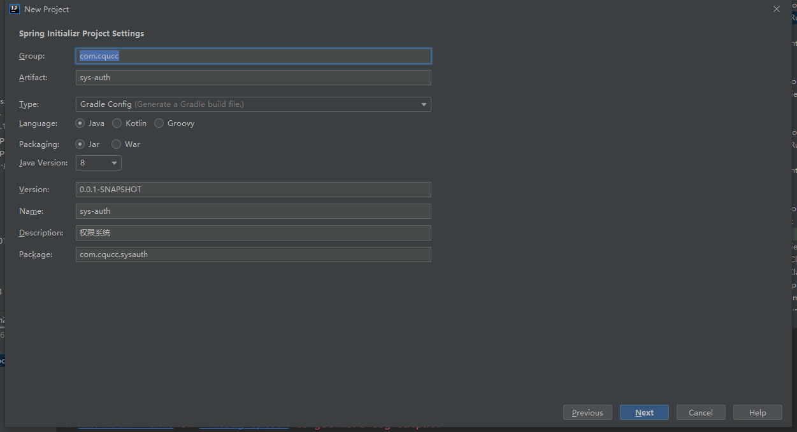
   
     * 选择依赖 (这里直接下一步下一步即可因为这里生成的build.gralde后面创建子模块需要删除掉的）
   
       1. 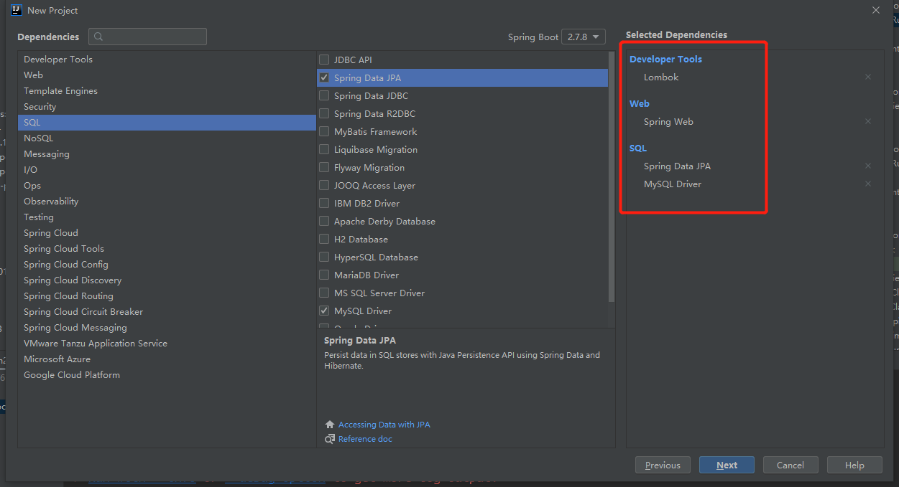
   
       2. 点击完成，创建成功项目后需要设置Gradle，我们这里使用的是本地Gradle7.5，或者你也可以在项目里面单独引入一个Gradle(这种需要选择第一个Gralde来源，并添加相应的文件)。
   
          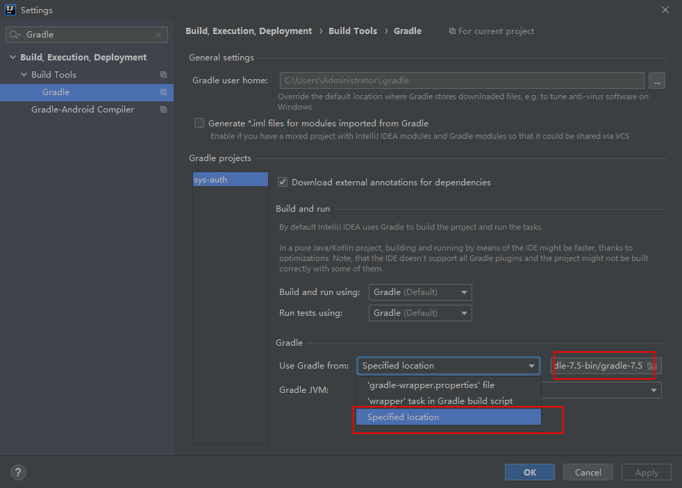
   
       3. 点击Gradle刷新按钮下载依赖即可（这种构建方式是不会帮你创建src目录的，如果需要你可以在Gradle中添加task生成）
   
          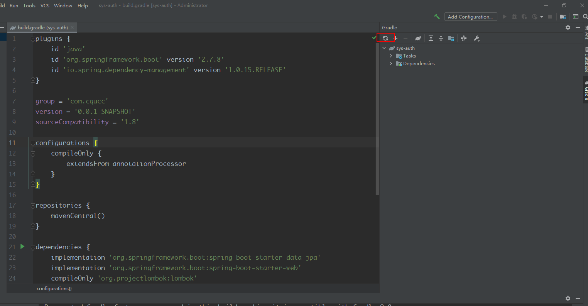
   
       4. 到这里我们根目录项目就算创建完成了，这个时候我需要手动删除根目录的`build.gradle`文件，并且添加`settings.gradle`文件,整体目前项目结构如下：
       
          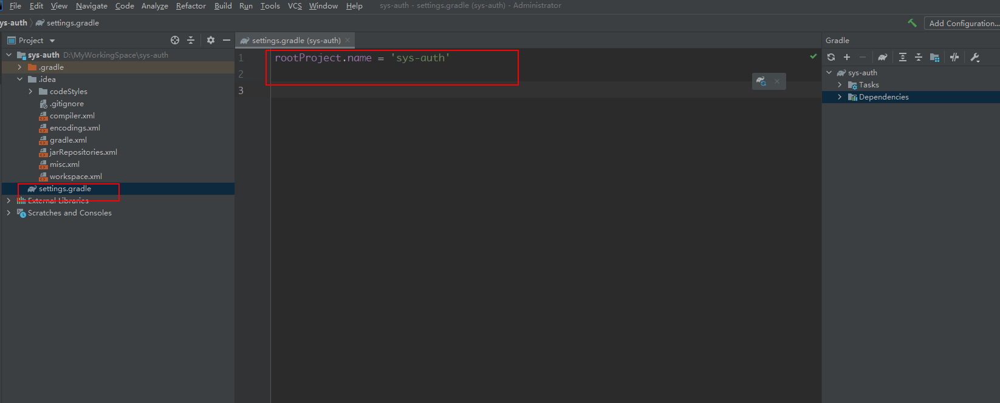
     
   * 构建授权服务器（auth-server）模块（作为子模块）
   
     *  在`new`的时候选择使用Module。
   
       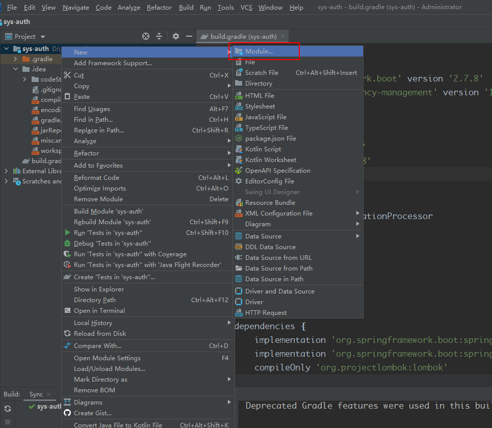
   
     * 子模块初始化设置
   
       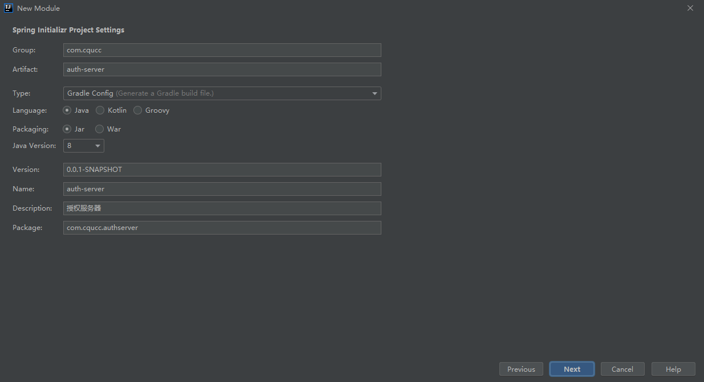
   
     * 子模块选择依赖 (具体依赖是看你需要什么功能来选择的)
   
       1. 选择Spring Boot版本为2.7.8 （默认会帮你选择最新版本，如果选择不到2.7.8可以先随便选择，生成之后再修改即可）
       2. 代码自动化工具勾选Lombok
       3. 需要对外提供服务，勾选Spring Web
       4. 勾选Jpa依赖
       
       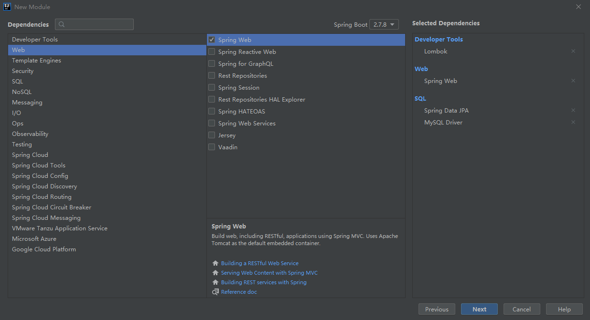
       
     * 点击完成，刷新Gradle
     
     * 补全src目录，这种方式构建的项目是没有src目录的，我们可以手动创建也可以通过添加gradle task创建，task配置如下：
     
       ```
       //使用后请删除或者注释，生成一次就可以了
       task 'create-dirs' {
       	sourceSets*.java.srcDirs*.each {
       		it.mkdirs()
       	}
       	sourceSets*.resources.srcDirs*.each {
       		it.mkdirs()
       	}
       }
       ```
     
     * 添加父子模块依赖关系
     
       在根项目下的`setting.gradle`文件下添加 `include 'auth-server'`，再次刷新Gradle，我们就可以在右侧IDEA中看到子模块的Gradle信息
     
       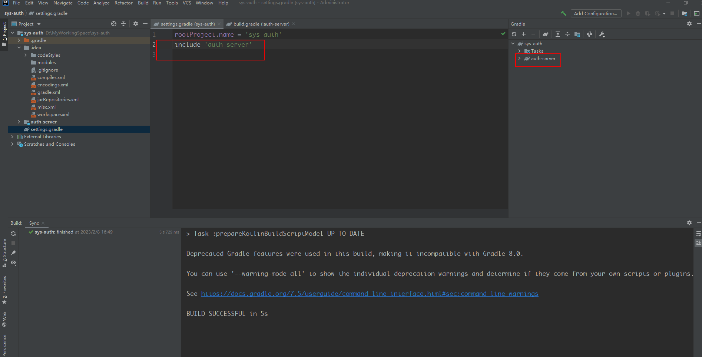
     
   * 同理构建资源服务器（resource-server）模块
   
   * 构建完成后补全Spring Boot子模块,使之完整目录结构如下：
   
     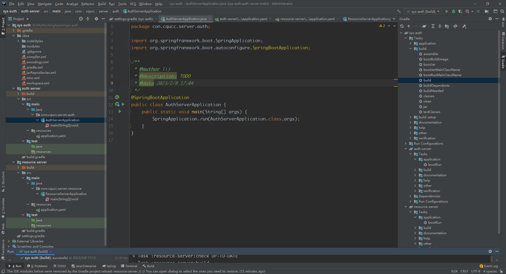
   
   * 测试子模块启动、打包
   
     * 启动除了用Main启动还可以通过Gradle Task启动
   
       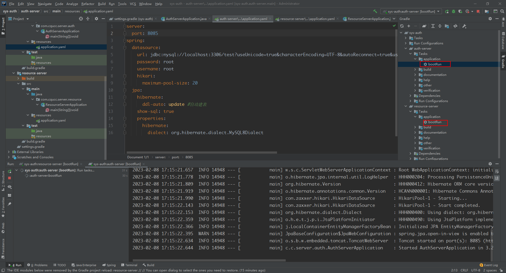
   
     * 打包通过Gradle`bootjar`任务构建，构建完成后在模块路径下`./build/libs/`找到对应的jar包
   
       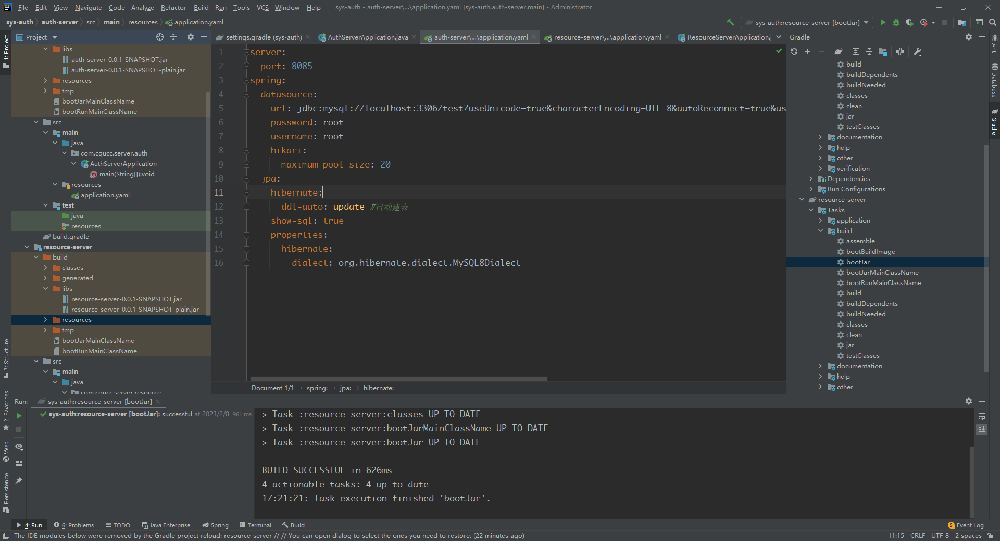


# 配置授权服务器


## 1. 授权服务器相关知识学习

我们在添加依赖时发现要实现授权服务器有多种依赖，并不知道使用哪个，于是抱着学习的态度去学习了一下授权服务器相关知识。

* 根据SpringBoot文档Oauth2小结中对Auth Server有如下的介绍：（https://docs.spring.io/spring-boot/docs/2.7.8/reference/htmlsingle/#web.security.oauth2.authorization-server）

  **Authorization Server**

     Currently, Spring Security does not provide support for implementing an OAuth 2.0 Authorization Server. However, this functionality is available from the [Spring Security OAuth](https://spring.io/projects/spring-security-oauth) project, which will eventually be superseded by Spring Security completely. Until then, you can use the spring-security-oauth2-autoconfigure module to easily set up an OAuth 2.0 authorization server; see its [documentation](https://docs.spring.io/spring-security-oauth2-boot/) for instructions.

* 根据Github Spring Security项目中的一些常见问题阐述了对OAuth 2.0的支持：(https://github.com/spring-projects/spring-security/wiki/OAuth-2.0-Features-Matrix)

  1. ***Is there a way to integrate Spring Security OAuth in Spring Boot 2.0?***

     The [Spring Security OAuth Boot 2 Autoconfig](https://github.com/spring-projects/spring-security-oauth2-boot) project is a port of the Spring Security OAuth auto-configuration contained in Spring Boot 1.5.x. If you would like to use Spring Security OAuth in Spring Boot 2.0, you must explicitly include the following dependency in your project:

     - **groupId:** `org.springframework.security.oauth.boot`
     - **artifactId:** `spring-security-oauth2-autoconfigure`

​		综合上述文档说明有一个Spring Security Oauth  项目用来提供授权服务器，但是我们点进去后可以发现这个项目已经被Spring Security 5取代了，并且Spring Boot 2.0已经放弃了对这个项目的支持，  并且告知我们想在Spring Boot 2.0中集成 ，可以添加`org.springframework.security.oauth.boot:spring-security-oauth2-autoconfigure`模块到项目中，并以此来实现OAuth 2.0 授权服务器，其实这个spring-security-oauth2-autoconfigure项目也只是对Spring Security Oauth做的自动配置而已，并且他们两个都已经停止维护了。（停止维护不代表不可以使用，只是不在提供相关文档支持和推荐）

*  **以下是在学习授权服务器相关知识时找到的一些项目，于是做了一个表格进行说明**

| 项目                                                         | 功能                                                         | 目前状态                                                     | 相关资料                                                     |
| :----------------------------------------------------------- | ------------------------------------------------------------ | ------------------------------------------------------------ | ------------------------------------------------------------ |
| org.springframework.security.oauth.boot:spring-security-oauth2-autoconfigure | 能够在Spring Boot 2.0中自动配置Spring Security OAuth  项目   | 最后一个版本为2.6.8在2022.6月后不在主动维护，2.6.8里支持的是Spring Security Oauth 2.5 | [项目地址](https://github.com/spring-attic/spring-security-oauth2-boot  )  ；[文档地址 ](https://docs.spring.io/spring-security-oauth2-boot/) |
| org.springframework.security.oauth:spring-security-oauth2 （Spring Security OAuth） | Spring Security OAuth  完全支持了OAuth2授权协议，它支持`Clinet 、Reource Server、Authorization Server`一整套几乎所有功能。 | Spring Security OAuth 项目已结束生命周期，在2022.5月不再主动维护。最后一个大版本为2.5。并且在[官方文档](https://spring.io/projects/spring-security-oauth)中声明该项目已经被`Spring Security`和`Spring Authorization Server` 两者提供的OAuth2支持所取代，换句话说这个项目被拆分成了`Spring Security`中对OAuth2的实现+ `Spring Authorization Server` 对OAuth2的实现 | [项目地址](https://github.com/spring-attic/spring-security-oauth) |
| org.springframework.boot:spring-boot-starter-security（Spring Security） | Spring Security 5 （5.4+）开始内置对 OAuth 2.0   登录、客户端和资源服务器的支持 | 积极更新中，可以在项目空间的wiki-功能矩阵-常见问题下看到OAuth的支持 | [项目地址](https://github.com/spring-projects/spring-security)； [文档地址](https://docs.spring.io/spring-security/reference/) |
| org.springframework.security:spring-security-oauth2-authorization-server  (Spring Authorization Server） | 该项目取代了Spring Security OAuth提供的授权服务器支持，并且支持的协议为OAuth2.1 | 由`Spring Security团队领导`的 Spring Authorization Server 项目专注于为 Spring 社区提供`OAuth 2.1 Authorization Server`支持, | [项目地址](https://github.com/spring-projects/spring-authorization-server)；  [文档地址](https://docs.spring.io/spring-authorization-server/docs/current/reference/html/) |

**思考一：**为什么将Spring Security OAuth停止维护了呢？ 

1.  在Spring项目组合中，OAuth 2.0支持的组件有很多：[Spring Security OAuth](http://projects.spring.io/spring-security-oauth/)、[Spring Cloud Security](https://cloud.spring.io/spring-cloud-security/)、为了统一支持，避免混淆，所以进行了拆分，[参考文档](https://spring.io/blog/2018/01/30/next-generation-oauth-2-0-support-with-spring-security)

**思考二：**为什么Spring Security为什么不将授权服务器支持也纳入进去？这是因为Spring Security作为一个安全框架，本质上不适合搭建授权服务器，授权服务器是一个独立的系统，需要特定的库。而Spring Security仅仅是一个安全框架不涉及提供库或产品的业务。例如Spring Security没有提供JWT库。因此我们需要使用Nimbus等其他库来支持JWT。因此，如果需要构建授权服务器，Spring Security并不是一个合适的选择， [参考资料](https://spring.io/blog/2020/04/15/announcing-the-spring-authorization-server)


* **功能矩阵：Spring Security 关于OAuth2.0 功能矩阵（[官方地址](https://github.com/spring-projects/spring-security/wiki/OAuth-2.0-Features-Matrix) ），由于目前Spring Security在不断改进,目前的功能矩阵如下**


### Client Support

|                                                  | [Spring Security](https://projects.spring.io/spring-security/) (5.4+) | [Spring Security OAuth](https://projects.spring.io/spring-security-oauth/) (2.5) | [Spring Cloud Security](https://cloud.spring.io/spring-cloud-security/) (1.2+) | [Spring Boot OAuth2](https://projects.spring.io/spring-boot/) (1.5.x) |
| ------------------------------------------------ | ------------------------------------------------------------ | ------------------------------------------------------------ | ------------------------------------------------------------ | ------------------------------------------------------------ |
| **Authorization Grants** (授权模式)              |                                                              |                                                              |                                                              |                                                              |
| Authorization Code（授权码模式）                 | ✔                                                            | ✔                                                            |                                                              |                                                              |
| Implicit （简化模式）                            |                                                              | ✔                                                            |                                                              |                                                              |
| Resource Owner Password Credentials （密码模式） | ✔                                                            | ✔                                                            |                                                              |                                                              |
| Client Credentials （客户端模式）                | ✔                                                            | ✔                                                            |                                                              |                                                              |
| Refresh Token                                    | ✔                                                            | ✔                                                            |                                                              |                                                              |
| Client Authentication Methods                    |                                                              |                                                              |                                                              |                                                              |
| HTTP Basic                                       | ✔                                                            | ✔                                                            |                                                              |                                                              |
| HTTP POST                                        | ✔                                                            | ✔                                                            |                                                              |                                                              |
| **HTTP Client Support**                          |                                                              |                                                              |                                                              |                                                              |
| RestTemplate **[1]**                             | ✔                                                            | ✔                                                            |                                                              |                                                              |
| WebClient                                        | ✔                                                            |                                                              |                                                              |                                                              |
| **User Authentication**                          |                                                              |                                                              |                                                              |                                                              |
| OAuth 2.0 Login (SSO)                            | ✔                                                            |                                                              |                                                              | ✔                                                            |
| UserInfo Endpoint Support                        | ✔                                                            |                                                              |                                                              | ✔                                                            |
| **Access Token Storage Management**              |                                                              |                                                              |                                                              |                                                              |
| In-Memory                                        | ✔                                                            |                                                              |                                                              |                                                              |
| JDBC                                             | ✔                                                            | ✔                                                            |                                                              |                                                              |

1. RestTemplate 可以配合[DefaultOAuth2AuthorizedClientManager](https://docs.spring.io/spring-security/site/docs/current/reference/htmlsingle/#oauth2Client-authorized-manager-provider)实现全面支持。

### Resource Server Support

|                                         | [Spring Security](https://projects.spring.io/spring-security/) (5.4+) | [Spring Security OAuth](https://projects.spring.io/spring-security-oauth/) (2.5) | [Spring Cloud Security](https://cloud.spring.io/spring-cloud-security/) (1.2+) | [Spring Boot OAuth2](https://projects.spring.io/spring-boot/) (1.5.x) |
| --------------------------------------- | ------------------------------------------------------------ | ------------------------------------------------------------ | ------------------------------------------------------------ | ------------------------------------------------------------ |
| **Access Token Formats**                |                                                              |                                                              |                                                              |                                                              |
| Opaque                                  | ✔                                                            | ✔                                                            |                                                              |                                                              |
| JSON Web Token (JWT)                    | ✔                                                            | ✔                                                            |                                                              |                                                              |
| **Access Token Usage**                  |                                                              |                                                              |                                                              |                                                              |
| Token Relay                             | ✔                                                            |                                                              | ✔                                                            |                                                              |
| **Access Token Verification**           |                                                              |                                                              |                                                              |                                                              |
| Opaque (using Introspection Endpoint)   | ✔                                                            | ✔                                                            |                                                              |                                                              |
| JSON Web Signature (MAC)                | ✔                                                            | ✔                                                            |                                                              |                                                              |
| JSON Web Signature (RSA)                | ✔                                                            | ✔                                                            |                                                              |                                                              |
| JSON Web Signature (using JSON Web Key) | ✔                                                            | ✔                                                            |                                                              |                                                              |
| Custom JWT Claims Set Verifier          | ✔                                                            | ✔                                                            |                                                              |                                                              |

### Authorization Server Support

|                                            | [Spring Authorization Server](https://github.com/spring-projects/spring-authorization-server/) (0.2.0) | [Spring Security OAuth](https://projects.spring.io/spring-security-oauth/) (2.5) | [Spring Cloud Security](https://cloud.spring.io/spring-cloud-security/) (1.2+) | [Spring Boot OAuth2](https://projects.spring.io/spring-boot/) (1.5.x) |
| ------------------------------------------ | ------------------------------------------------------------ | ------------------------------------------------------------ | ------------------------------------------------------------ | ------------------------------------------------------------ |
| **Authorization Grants**                   |                                                              |                                                              |                                                              |                                                              |
| Authorization Code                         | ✔                                                            | ✔                                                            |                                                              |                                                              |
| Implicit                                   | Not implemented **[1]**                                      | ✔                                                            |                                                              |                                                              |
| Resource Owner Password Credentials        | Not implemented **[1]**                                      | ✔                                                            |                                                              |                                                              |
| Client Credentials                         | ✔                                                            | ✔                                                            |                                                              |                                                              |
| Refresh Token                              | ✔                                                            | ✔                                                            |                                                              |                                                              |
| **Protocol Endpoints**                     |                                                              |                                                              |                                                              |                                                              |
| Authorization Endpoint                     | ✔                                                            | ✔                                                            |                                                              |                                                              |
| Token Endpoint                             | ✔                                                            | ✔                                                            |                                                              |                                                              |
| User Consent Endpoint                      | ✔                                                            | ✔                                                            |                                                              |                                                              |
| Introspection Endpoint                     | ✔                                                            | ✔                                                            |                                                              |                                                              |
| **Access Token Formats**                   |                                                              |                                                              |                                                              |                                                              |
| Opaque                                     |                                                              | ✔                                                            |                                                              |                                                              |
| JSON Web Signature (MAC)                   | ✔                                                            | ✔                                                            |                                                              |                                                              |
| JSON Web Signature (RSA)                   | ✔                                                            | ✔                                                            |                                                              |                                                              |
| **Access Token Storage Management**        |                                                              |                                                              |                                                              |                                                              |
| In-Memory                                  | ✔                                                            | ✔                                                            |                                                              |                                                              |
| JDBC                                       | ✔                                                            | ✔                                                            |                                                              |                                                              |
| Redis                                      |                                                              | ✔                                                            |                                                              |                                                              |
| **Client Authentication Methods**          |                                                              |                                                              |                                                              |                                                              |
| HTTP Basic                                 | ✔                                                            | ✔                                                            |                                                              |                                                              |
| HTTP POST                                  | ✔                                                            | ✔                                                            |                                                              |                                                              |
| **Client Registration Storage Management** |                                                              |                                                              |                                                              |                                                              |
| In-Memory                                  | ✔                                                            | ✔                                                            |                                                              |                                                              |
| JDBC                                       | ✔                                                            | ✔                                                            |                                                              |                                                              |
| **Authorization Code Storage Management**  |                                                              |                                                              |                                                              |                                                              |
| In-Memory                                  | ✔                                                            | ✔                                                            |                                                              |                                                              |
| JDBC                                       | ✔                                                            | ✔                                                            |                                                              |                                                              |
| **User Consent Storage Management**        |                                                              |                                                              |                                                              |                                                              |
| In-Memory                                  | ✔                                                            | ✔                                                            |                                                              |                                                              |
| JDBC                                       | ✔                                                            | ✔                                                            |                                                              |                                                              |

1. [OAuth 2.1 授权框架](https://tools.ietf.org/html/draft-ietf-oauth-v2-1-01)中已省略（弃用）隐式授权和资源所有者密码凭证授权，在最新的OAuth协议中已经找不到简化模式和密码模式了。
2. Sping Authorization Server 是对OAuth 2.1的支持，所以在2.0中的简化模式、密码模式都没有实现。
3. OAuth 2.0在2012年就出现了 , 而OAuth 2.1在2020年才提出。

## 2. 将授权服务器运用到实际项目

1. 在`auth-server`模块下的`build.gradle`文件中添加授权服务器相关依赖：`org.springframework.security:spring-security-oauth2-authorization-server:0.4.0` (1.0.0版本需要  JDK > =17 )
2. 

​		
