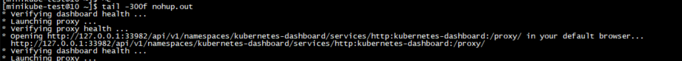
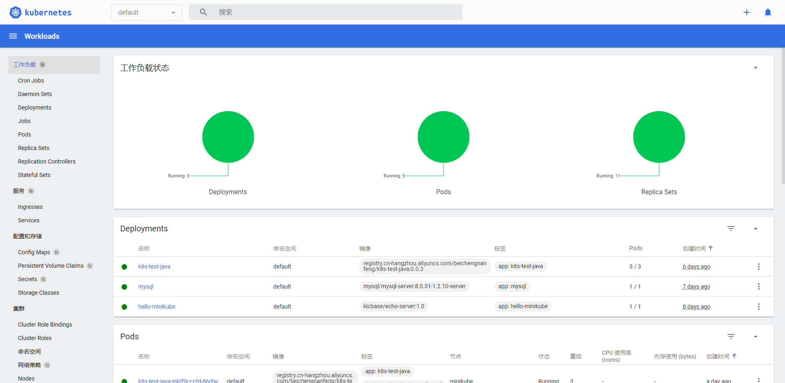
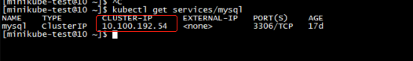
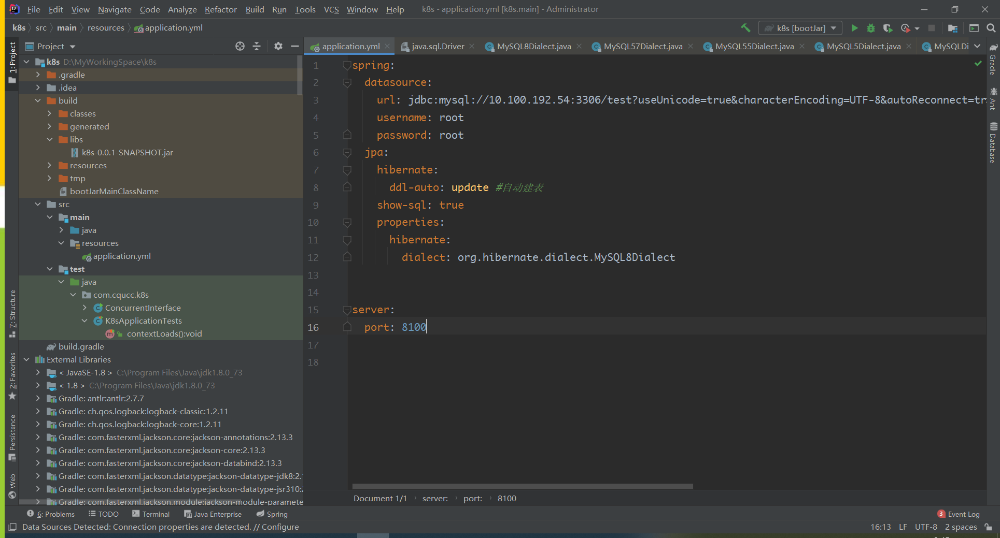
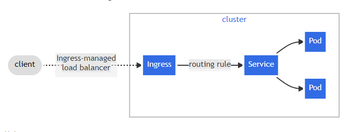
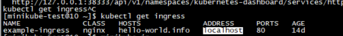
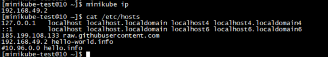
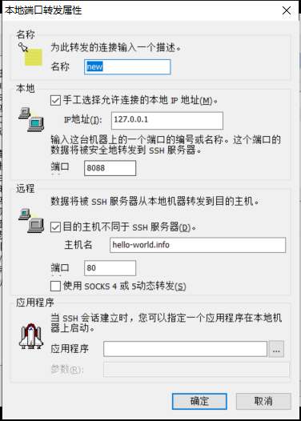
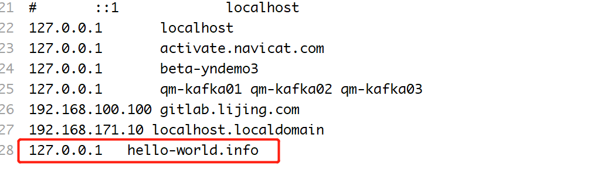

## 前言
 年底事情不多，于是想着搞个k8s技术文章，一来检验之前零零散散的学习k8s成果,二来是想突破一下使用k8s部署一整套java应用。
## 目标

 **本篇围绕以下四个目标进行撰写**

 **1. 运行k8s集群，熟悉k8s命令，理解k8s架构 （deployment/pod/service/port-forward）。**
 
 **2. 在k8s上运行mysql。实现k8s应用部署。**
 
 **3. 在k8s上运行java程序（负载均衡），让容器内java程序连接到k8s的mysql。实现k8s容器通信技术（知识点：igress、services）。**
 
 **4. 持久化mysql容器数据卷。实现卷(持久卷)功能（知识点：volumes、PV、PVC）。**

## 本教程环境
 **操作系统：centos7.8**
 
 **Docker：20.10.8**
 
 **minikube: v1.24.0**
 
 **kubectl Client Version: version.Info{Major:"1", Minor:"22", GitVersion:"v1.22.0"}** 
 
 **kubectl Server Version: version.Info{Major:"1", Minor:"22", GitVersion:"v1.22.3"}**
 

## 实现

#### ⑴ 安装k8s本地集群（minikube）
 1. minikube的安装在这篇文章中已经写过了，这里就不在赘述了。[点击这里](./minikube.md)
 
 2. 启动minikube,并且使用国内代理镜像仓库 `minikube start  --cpus=4 --image-mirror-country='cn' --image-repository='registry.cn-hangzhou.aliyuncs.com/google_containers' `
 
 3. 打开minikube仪表盘 `minikube dashboard` 
 
 
 4. 浏览器访问给出的地址打开k8s管理界面
 
 
#### ⑵ 在k8s中部署mysql服务
 1. 创建deployment `kubectl create deployment mysql --image=mysql/mysql-server:8.0.31-1.2.10-serve`  mysql镜像版本可以在dokcerhub中找到我这里使用的是最新版

 2. 创建sevice `kubectl expose deployment mysql --type=NodePort --port=3306` 不指定sevice type的话默认下为ClusterIP
 
 3. 查看部署状态`kubectl get deployments/mysq;` 或者 `kubectl get pods`
 
 4. 查看sevice情况 `kubectl get services/mysql`
 
 5. 部署成功并且创建service成功后,查看pod日志获取mysql初始密码 `kubectl logs mysql-6887698894-l4wl9` 注意这里的pod名称是看你运行的mysql pod，可以通过命令`kubectl get pods`查看。
 
 6. 进入pod修改密码、修改允许root登录等常规mysql配置。`kubectl exec -it mysql-6887698894-l4wl9 -- bin/bash` 修改可参考这两篇文章：https://blog.csdn.net/mfkarj/article/details/81163644  https://blog.csdn.net/qq_36501494/article/details/121571843
 
 7. 访问mysql service，需要访问mysql服务需要转发端口(port-forward)或者使用k8s 代理(proxy),这里我推荐使用转发端口的方式。 `kubectl port-forward services/mysql 3306:3306 --address 0.0.0.0`  注意这里的地址就是你用mysql连接的这里使用0.0.0.0为你服务器地址，端口前面的3306端口也是在服务器打开的，后面的3306是k8s mysql service 的端口
 
 
 8. 到这里使用navicat连接mysql服务后就可以操作数据库了，如果出现连接错误请查看是否配置正确。

#### ⑶ 在k8s中部署java程序
 1. **创建一个基本的java程序，数据库连接到k8s容器中的mysql服务。**
 	* 确定通信模型：`pod和服务之间通信`。 （java pod访问 mysql service。 service 的cluster ip相对固定，除非删除service）
 	* 查看集群mysql service ip `kubectl get services/mysql`（这里是利用集群内部ip可以互相访问，）
 	  
 	* 配置java程序数据库信息
 	  

 2. **打包java服务，编写Dockerfile以构建镜像 （构建完成后上传到aliyun镜像仓库 ）此步骤略**
    *  `Dockerfile信息：`
      ```
      FROM    centos:6.7
      MAINTAINER    lijing
      ADD jdk-8u221-linux-x64.tar.gz  /usr/local/
      COPY k8s-0.0.1-SNAPSHOT.jar /home/data/
      ENV  JAVA_HOME /usr/local/jdk1.8.0_221
      ENV  CLASSPATH $JAVA_HOME/lib/dt.jar:$JAVA_HOME/lib/tools.jar
      ENV  PATH $PATH:$JAVA_HOME/bin
      EXPOSE    8100
      CMD    java -jar /home/data/k8s-0.0.1-SNAPSHOT.jar
      ```
 3. **部署java服务**
 	* 创建depoloyment: ` kubectl create deployment k8s-test-java --image=registry.cn-hangzhou.aliyuncs.com/beichengnanfeng/k8s-test-java:0.0.3` （ps,这里使用的是从0.0.1改到了0.0.3因为之前配置写错了两次,所以迭代到了0.0.3）
 	
	* 创建service：`kubectl expose deployment k8s-test-java --type=NodePort --port=8100`
 	
	* 转发端口，以访问服务: `kubectl port-forward  services/k8s-test-java 8100:8100 --address 0.0.0.0`
 	
	* 访问服务，查看能否获取到数据库数据。

 4. **pod流量负载均衡处理（ingress）**
    
    参考文档:`https://kubernetes.io/docs/concepts/services-networking/ingress/` `https://kubernetes.io/docs/tasks/access-application-cluster/ingress-minikube/`
    > 我们通过增加pod副本 (replicas),使deployment的replicas的数量为3.这个时候进行多次的访问java服务，发现始终访问的为同一个pod上，这很明显不符合负载均衡的理念，应该为三个pod均匀的接收和处理请求，查阅k8s资料需要通过ingress做负载才可以。
    > ingress是管理对集群中服务的外部访问的 API,将来自集群外部的 HTTP 和 HTTPS 路由暴露给集群内的sevice。流量路由由 Ingress 资源上定义的规则控制。如图所示：
    > 
    
    * 部署ingress controller （光有ingress资源是没有效果的，需要ingress控制器,这里使用的是nginx,可以在官网找到其他的控制器）
      
      * 参考[使用 NGINX Ingress Controller 在 Minikube 上设置 Ingress](https://kubernetes.io/docs/tasks/access-application-cluster/ingress-minikube/)
      
      * 在minikube上启用ingress controller. `minikube addons enable ingress` 这会在k8s集群中创建并部署nginx。
      
      * 查看是否部署成功`kubectl get pods -n ingress-nginx`
    
    * 创建ingress资源
      
      * 编写yaml文件
        ```
        apiVersion: networking.k8s.io/v1
        kind: Ingress
        metadata:
          name: example-ingress
        spec:
          rules:
            - host: hello-world.info
              http: 
                paths:
                  - pathType: Prefix
                    path: /hello
                    backend:
                      service:
                        name: k8s-test-java
                        port:
                          number: 8100
        ```
     
     * 创建 ingress 对象  `kubectl apply -f example-ingress.yaml`
     
     * 验证是否创建成功 `kubectl get ingress`
      
     
     * 修改服务器所在hosts,添加hello-world.info 的ip映射关系。由于是在本地运行的minikube,所以从上图的ingress中显示的是address ip 为内部ip(localhost)。这里需要使用`minikube ip`获取外部IP，来作为hosts映射
      
     
     * **访问java服务API。** 这个时候在多次访问service就会将请求均匀的分布到各个pod中。 
      
     
     * 如果想在本地windows中网页直接访问,那么除了配置隧道还需要在windows上配置hosts,如果直接通过ip访问是会404的。
       
       * 隧道配置：
       
       * windows hosts： 
       
       * 浏览器访问：http://hello-world.info:8088/hello/all ,如果使用http://127.0.0.1:8088/hello/all 则会404（ps：注意需要关闭梯子有的梯子代理的时候会占用某些端口）

  
#### ⑷ mysql数据持久卷处理 
 
 背景：默认情况下的pod存储空间为临时卷，临时卷跟随pod的生命周期并于pod一起创建和删除，所以当我们需要某些pod的存储空间不跟随pod本身生命周期创建删除时，那么就需要使用到持久卷，将这块存储空间独立出来。
 
 参考文档：`https://kubernetes.io/docs/concepts/storage/volumes/`  `https://minikube.sigs.k8s.io/docs/handbook/persistent_volumes/`
 
 持久卷的开辟需要三个资源：**1. storage classes 2. persistent volumes 3.persistent volume claims**
 
 1. **storage classes（存储类）**
	minikube提供了开箱即用的动态pv（卷类型为：hostpath），他会在minikube VM内创建数据盘。 此外还提供了默认基于hostpath的存储类`provisioner: k8s.io/minikube-hostpath`。 可以直接创建PVC就可以使用。我们这里不使用卷类型为hostpath类型，使用Local类型。因为：与`hostPath卷`相比，`local卷`以持久和便携的方式使用，无需手动将 pod 调度到节点。 创建配置如下：
    ```
   apiVersion: storage.k8s.io/v1
   kind: StorageClass
   metadata:
      name: local-storage
   provisioner: kubernetes.io/no-provisioner
   volumeBindingMode: WaitForFirstConsumer
    ```
 
 2. **persistent volumes (pv)**
 	> PersistentVolume (PV) 是集群中的一块存储资源。它是管理员通过声明pv资源或者动态类配置自动生成的。他是一种持久卷插件，生命周期独立。

	pv分为两种：**动态PV**和**静态PV**
    静态pv：自己定义的资源
    动态pv：没有定义pv，通过pvc关联的storageclasses动态生成的pv
    hostpath卷支持动态pv，即可以不用定义pv资源。
    local卷仅支持静态pv，即需要定义pv资源
	local卷pv配置：
    ```
    apiVersion: v1
    kind: PersistentVolume
    metadata:
      name: example-pv
    spec:
      capacity:
        storage: 10Gi
      volumeMode: Filesystem
      accessModes:
      - ReadWriteOnce
      persistentVolumeReclaimPolicy: Retain
      storageClassName: local-storage
      local:
        path: /mnt/disks/ssd1
      nodeAffinity:
        required:
          nodeSelectorTerms:
          - matchExpressions:
            - key: kubernetes.io/hostname
              operator: In
              values:
               - minikube
    ```
 
 3. persistent volumes claims (pvc)
    > persistent volumes claims (pvc) 是用户的**存储请求**资源。它接收pod的存储请求，消耗pv资源。

    local pv 配置如下
	```
    apiVersion: v1
    kind: PersistentVolumeClaim
    metadata:
      name: myclaim123
    spec:
      accessModes:
        - ReadWriteOnce
      volumeMode: Filesystem
      resources:
        requests:
          storage: 5Gi
      volumeName: example-pv
      storageClassName: local-storage
    ```
    
    注意的是`volumeName`可以不用特别指定，会通过storageclassName去匹配存储类也相同的pv。如果定义的存储类的卷类型是支持动态pv那么搜索不到的时候会自动创建pv，如果不支持那么必须存在名称相同storageclassName的pv,并且pv的状态是非`released`,并且pvc解绑pv回收策略为：`Retain`这种pv都会变成`released`,所以在解绑此类pv后通常需要删除pv处理,或者手动处理.[回收策略解释](https://kubernetes.io/docs/concepts/storage/persistent-volumes/#reclaiming)
