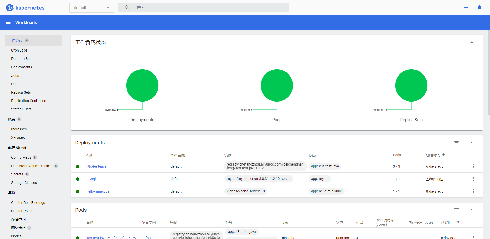

## 前言
 minikube作为k8s的学习环境，他是以一个**VM**的形式运行，在VM内运行了k8s本地单机集群。通常作为学习k8s的入门方案。
## 硬件参考环境

 * 操作系统: centos 7.8 

 * minikube: latest(最新稳定版)v1.24.0 (64位、amd架构，这和操作系统相关） 其他版本架构请访问(https://github.com/kubernetes/minikube/releases)

 * kubectl: latest(v1.23.0) 其他版本（https://github.com/kubernetes/kubectl/tags

 * docker: latest 使用yum安装

## 组件说明

* kebectl: k8s的命令行工具，通常用来部署应用、管理k8s资源。（可以理解为客户端操作入口）

* minikube: 创建k8s集群（本地单机集群）

* docker：负责运行容器的软件。 minikube默认使用docker作为首选容器运行驱动。除了docker以外还有VM、ssh等。具体可查阅（https://minikube.sigs.k8s.io/docs/drivers/）

## 安装要求

* minikube:

 * cpu>=2

 * 内存>2GB

 * 磁盘空间>20GB

 * 联网（非必须，只是下载镜像时使用的为互联网中的镜像，有私库其他镜像也可）

 * 容器管理或者虚拟机管理软件 （docker /Podman / Hyperkit/ Hyper-V / VirtualBox）,这里使用的是docker

* docker：

  * version>=18.09 

  * 注意：20.10 或更高版本,运行时不能使用root运行minikube，否则minikube不能正常启动

  * 这里我使用的是方式是创建一个新用户，但给新用户赋予root的权限

* docker: 非root账户启动

## 实现
 1. minikube [参考文档]( https://minikube.sigs.k8s.io/docs/start/)
  * 下载:`curl -LOhttps://kubernetes.io/docs/concepts/services-networking/https://kubernetes.io/docs/concepts/services-networking/ingress/https://kubernetes.io/docs/concepts/services-networking/ingress/https://kubernetes.io/docs/concepts/services-networking/ingress/https://kubernetes.io/docs/concepts/services-networking/ingress/https://kubernetes.io/docs/concepts/services-networking/ingress/https://kubernetes.io/docs/concepts/services-networking/ingress/https://kubernetes.io/docs/concepts/services-networking/ingress/https://kubernetes.io/docs/concepts/services-networking/ingress/ https://storage.googleapis.com/minikube/releases/latest/minikube-linux-amd64`
  * 安装:`sudo install minikube-linux-amd64 /usr/local/bin/minikube`
 2. kubectl ，[参考文档]( https://kubernetes.io/docs/tasks/tools/install-kubectl-linux/)
  * 下载:`curl -LO "https://dl.k8s.io/release/$(curl -L -s https://dl.k8s.io/release/stable.txt)/bin/linux/amd64/kubectl"`
  * 安装： `sudo install -o root -g root -m 0755 kubectl /usr/local/bin/kubectl`
  * 版本查看：`kubectl version --client`
 3. 添加kubectl 别名，让每次使用kubectl都在minikube虚拟机内操作。（不用也可以就是操作k8s集群的时候需要多输入命令）
 `alias kubectl="minikube kubectl --"`
 4. 启动minikube 
  `minikube start` 
 5. 启动minikube仪表板，使用浏览器打开仪表盘 
  `nohup minikube dashboard 2>&1 &`
   
   