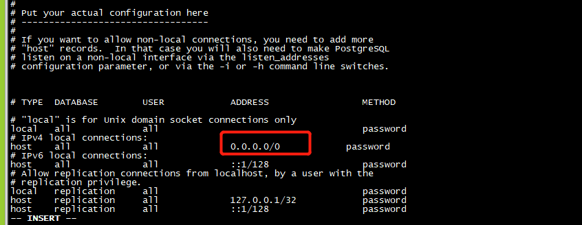

## 服务器情况
* 操作系统：centos7

## 安装包下载
> postgresql 10.0版本以上就没有linux版本的zip文件，但windows和mac一直都可以通过zip安装。由于我们这里选择的是12.8版本所以只能通过rpm安装。
 通过rpm安装可以选择yum直接安装或者使用手动下载rpm包的方式安装。考虑到有时候服务器不能通网本次安装就是用手动下载rpm包的方式进行安装。
下载地址：https://yum.postgresql.org/rpmchart/
选择12版本的`RHEL/CentOS/Oracle Linux 7 - x86_64`，进去后点击`PostgreSQL Database Server 12 PGDG`来到如下所示的页面。

下载除`postgresql12-contrib`的其他三个组件

## 软件安装
1. 将下载好的三个rpm包放置到服务器
2. 执行`yum -y install ./postgresql12-*`,执行会自动解析三者的依赖关系
3. 到这里就安装完毕了，你可以在/usr目录下看到pgsql-12文件夹

## 数据库初始化
由于 Red Hat 系列发行版的政策，PostgreSQL 安装不会启用自动启动或自动初始化数据库，要完成数据库安装，需要根执行以下步骤：
1. 创建用户,postgresql不支持使用root运行。执行命令：`adduser postgres` 如果已存在则不用创建
2. 创建数据目录。执行命令：`mkdir -p /opt/data/pgsql`
3. 将数据目录的拥有权改为`postgres`。执行命令：`chown postgres  /opt/data/pgsql`

4. 切换用户`su -postgres`
5. 初始化数据库` ./initdb -D /opt/data/pgsql/  -U postgres -A password -E utf8 --locale=C -W`

**参数解释：**
```
 -D  data                       指定初始化的数据库目录(此处为当前目录的data文件夹)

        -U  postgres                数据库超级用户名（此处为postgres，如果不设置，会用当前windows用户名为账号）

        -A  password              数据库使用密码授权

        -E  utf8                       数据库编码格式

        --locale=C                  数据库簇使用的本地化语言 

        -W                              命令行执行后 输入密码
```
6. 指定数据库目录，启动数据库：`./pg_ctl -D /opt/data/pgsql/  start`


7. 打开navicat连接这个时候是连接不上的，需要修改两个地方一个是监听地址和允许访问的ip列表。
	* 修改监听地址 `vi /opt/data/pgsql/postgresql.conf` 找到`#listen_addresses = 'localhost'`打开注释并将地址改为`0.0.0.0`。不修改是外部访问不到这个端口
	
	* 修改权限访问控制 `vi /opt/data/pgsql/pg_hba.conf`,改为允许所有ip进行密码访问。不修改连接会告诉不允许连接。
	
	
    * 修改后重启服务


8. 打开navicat连接填入信息，大功告成！
   