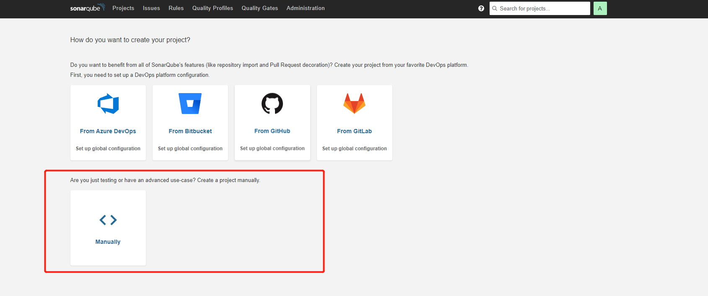
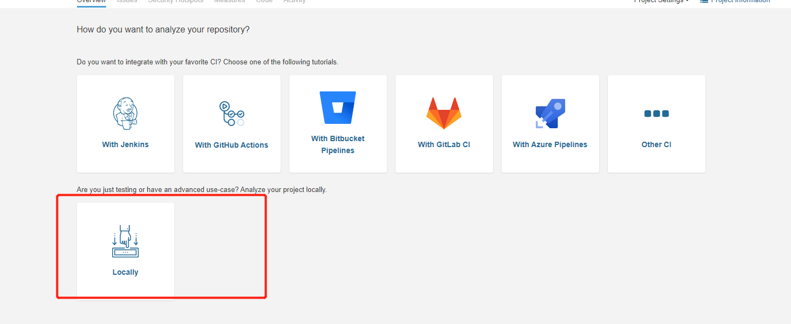
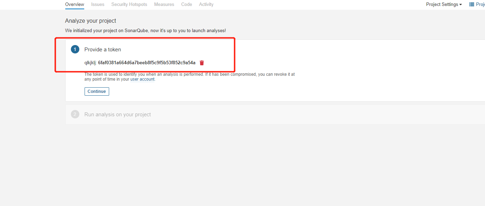
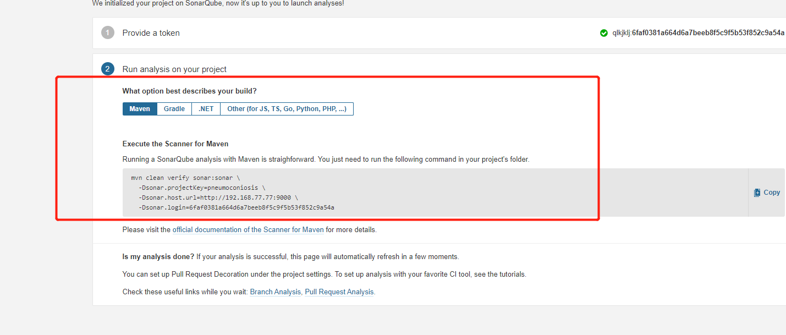
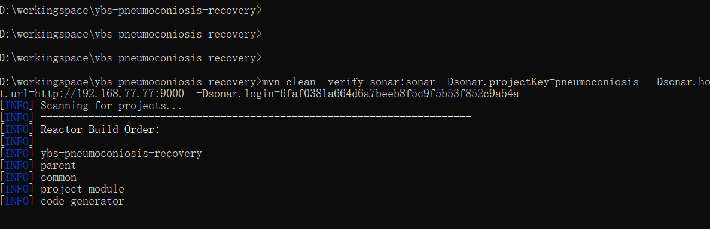
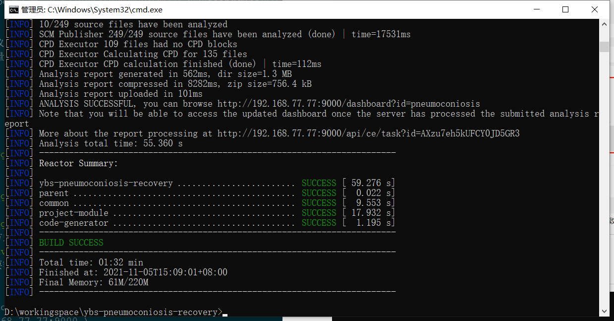
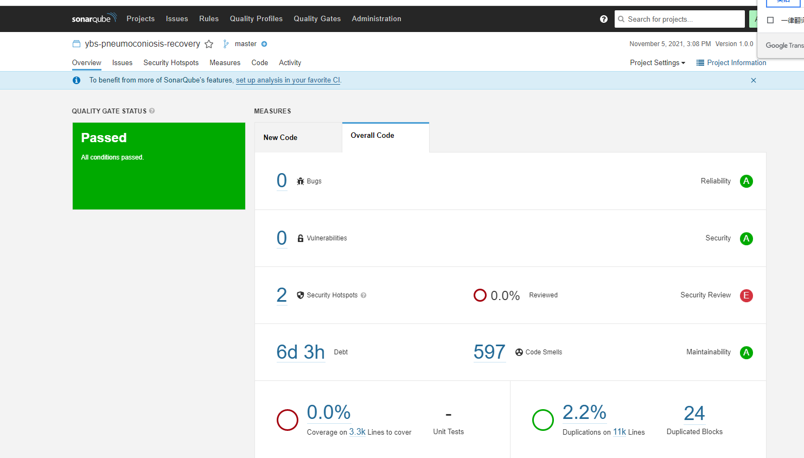
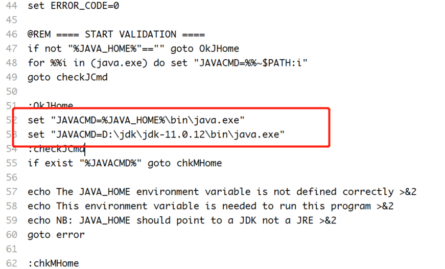

## 前言
在上一篇中我们了解到如何搭建sonarqube服务器，在本篇中就对如何使用代码扫描仪和soanrqube进行演示和说明。
## 概念
sonar代码分析的大致流程是客户端扫描仪扫描代码，扫描完成后将上传到sonarqube服务器，服务器收到扫描的结果后开启后台任务执行代码质量走查、安全扫描、覆盖率、重复行的工作，在执行完毕后存储到数据库中。

## 让我们开始分析项目吧
* 前置条件需要在sonarqube上创建项目
 1. 打开SonarQuber的web页面
 2. 点击创建新项目

 3. 填入项目名称和key
 4. 选择分析代码方式为本地

 5. 输入任意字符生成token

 6. 点击continue,选择扫描仪客户端方式得到maven指令（这里以maven为例）
 
 7. 打开项目代码执行mvn指令(这里需要额外注意,maven使用的jdk版本需要和sonarqube一致)
 ```
 mvn clean verify sonar:sonar \
  -Dsonar.projectKey=pneumoconiosis \
  -Dsonar.host.url=http://192.168.77.77:9000 \
  -Dsonar.login=6faf0381a664d6a7beeb8f5c9f5b53f852c9a54a
 ```

成功!!,如果出错请使用debug运行mvn指令查看错误原因。

 8. 打开sonar质量门查看
 
 
 **到这里本篇也就完结了！相信已经入门了，后面的更多功能就靠自己啦！**
## 特别说明
maven的jdk版本一定要满足大于等于sonar服务器的约束，否则执行mvn命令的时候会出错。
另外如果想修改maven的jdk使用版本可以硬指定，即不修改环境变量的方式。修改maven安装路径下的bin\mvn.cmd。在设置java路径后面硬指定即可`set "JAVACMD=D:\jdk\jdk-11.0.12\bin\java.exe"`。如图


