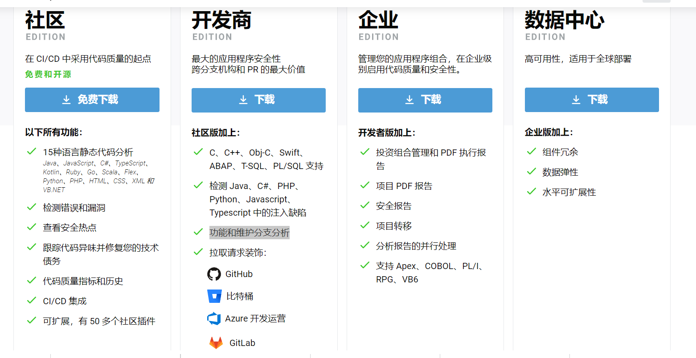
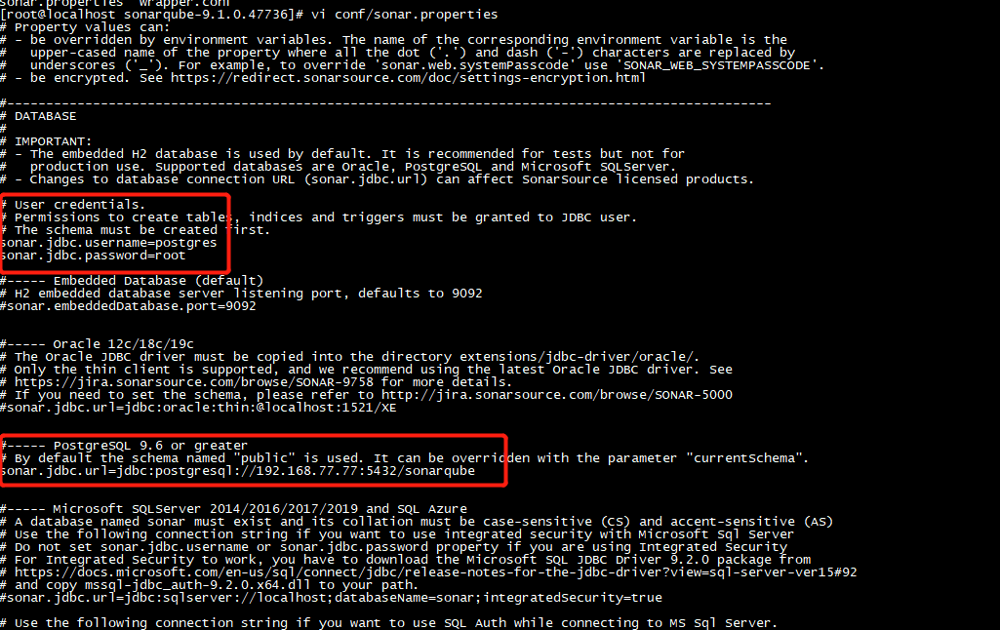
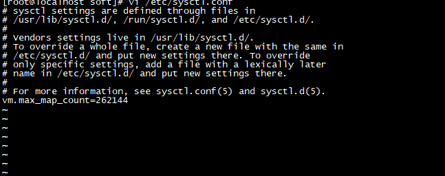
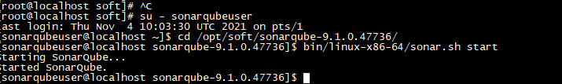
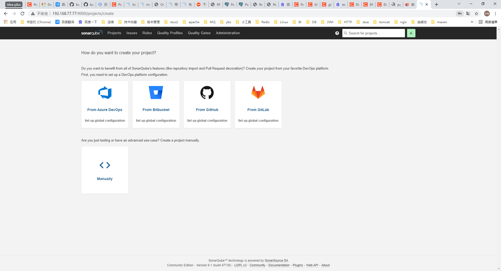

## 它是什么？
SonarQube 使所有开发人员能够编写更干净、更安全的代码。
## 工作流程
通过scanner扫描你的代码之后生成报告通过发送请求的方式发送给sonarqube服务器，sonarqube收到代码报告之后在后台开启任务,任务根据用户设置的规则进行代码质量和安全扫描并生成质量门，最后将任务结果存储到库中，具体什么库后面会说到。
1. SonarQube 服务器运行以下进程：
 *  为 SonarQube 用户界面提供服务的 Web 服务器。
  * 基于 Elasticsearch 的搜索服务器。
 * 负责处理代码分析报告并将其保存在 SonarQube 数据库中的计算引擎。

2. 存储以下内容的数据库：
 * 代码扫描期间生成的代码质量和安全性指标和问题。
 * SonarQube 实例配置。

## 先决条件和注意事项
* 硬件要求：
 *  2G内存（最低） 生产环境：8c 16G
 *  SonarQube 在服务器端不支持 32 位系统。但是，SonarQube 在扫描仪端支持 32 位系统。
* JDK：
  * sonarqube版本 >=7.9使用JDK11
  * sonarqube版本 <7.9使用JDK8
  * 如果服务器上安装了多个版本的 Java，则编辑安装路径下conf/wrapper.conf.`wrapper.java.command=/path/to/my/jdk/bin/java`
  * **jdk请自行安装**这里就不赘述了
* 数据库：目前支持以下三种
 *  postgreSql
 *  sqlserver
 *  oracle
 这里推荐使用postgresql,但是注意使用postgresql时需要数据库配置为使用 UTF-8 字符集。
* **注意事项**：
 * scanner扫描仪运行时的JDK版本必须大于等于sonarqube服务器Jdk版本
 * sonarqube`7.8（含）`以下使用的是`jdk8`,`7.9-9.1（目前最新）`使用的是`jdk11`
 * SonarQube 不能使用root在Unix 的系统上运行，因此如有必要，请为 SonarQube 创建一个专用用户

## 本次使用的服务器配置和软件版本清单
* 服务器：centos7
* 软件版本：postgresql:12.8 sonarQube:9.1 jdk: 11

## 软件下载
sonarqube有四个类型：社区版、开发者版、企业版、数据中心版。除了社区版免费使用，开发和企业版都是免费试用后需要付费使用，所以这里选择社区版，虽然社区版不支持分支的代码分析有点遗憾但是还是可以使用的。

版本说明:LTS为长期文档版本。如果是生产使用请使用这个版本。本教程用的是最新版本。
下载地址：https://binaries.sonarsource.com/Distribution/sonarqube/sonarqube-9.1.0.47736.zip

## 配置安装
1. 解压zip文件`unzip  sonarqube-9.1.0.47736.zip`
2. 添加数据库配置,如果库不存在需要手动创建库
	* 进入安装目录，添加数据库连接配置`vi ./vi conf/sonar.properties `
	
3. 创建用户`adduser sonarqubeuser`
4. 将安装目录拥有者修改为sonarqubeuser `chown -R sonarqubeuser ./sonarqube-9.1.0.47736`  
5. 修改sonarqubeuser用户的最大文件操作数（否则启动时es出现`bootstrap check failure [1] of [2]: max file descriptors [4096] for elasticsearch process is too low, increase to at least [65535]`错误）
	`vi  /etc/security/limits.conf`
	
6. 修改sonarqubeuser用户的最大内存（否则启动时es出现`bootstrap check failure [2] of [2]: max virtual memory areas vm.max_map_count [65530] is too low, increase to at least [262144]`错误）
	`vi /etc/sysctl.conf`添加`vm.max_map_count=262144`,添加后执行`/sbin/sysctl -p` 立即生效
    
7. 切换用户`su - sonarqubeuser`进入安装目录
8. 启动sonarqubeuser服务器`bin/linux-x86-64/sonar.sh start`

9. 检查日志文件./logs下是否有异常日志。
10. 访问http://loclhost:9000打开sonarqube的web程序

    至此sonarqube的服务端就安装完毕了，接下来说明如何使用扫描仪进行代码质量检查。

